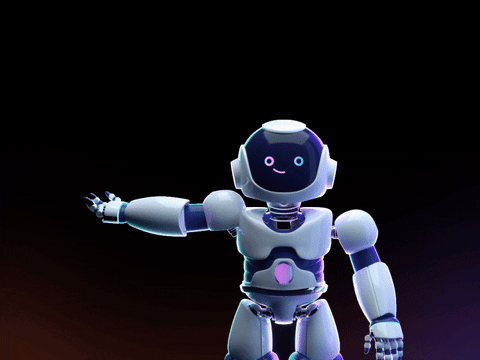

### Software Architect · Mumbai, India

*I design systems that scale — and build the tools to run them.*

---

## About

- 🏗️ 12 years designing and shipping enterprise-grade systems — financial platforms, event-driven architectures, cloud-native migrations
- 🤖 Currently building agentic AI pipelines: multi-agent content review, automated publishing, interview prep systems
- 🎓 M.Sc. Computer Science · University of Leicester, UK &nbsp;|&nbsp; B.Tech IT · SIES Mumbai
- 🌐 Everything I build lives at **[monalisadas-knowme.vercel.app](https://monalisadas-knowme.vercel.app)**

---

## Experience

**🏢 Software Architect** &nbsp;·&nbsp; Tangenesis Inc &nbsp;·&nbsp; *2023 – Present*
> Core architecture and development for enterprise financial software. Leading technical decisions, system design, and AI integration.

`C#` `.NET` `React` `SQL` `ChatGPT`

**🏢 Technical Specialist** &nbsp;·&nbsp; *2019 – 2022*
> Solutions design, team leadership, and full-stack delivery across cloud-native and on-prem environments.

`C#` `.NET` `Angular` `PostgreSQL` `AWS` `Terraform` `Octopus Deploy`

**🏢 Full Stack Developer** &nbsp;·&nbsp; *2019*
> End-to-end development across frontend, backend, and desktop.

`C#` `.NET` `Angular` `SQL` `Azure` `WPF`

---

## Tech Stack

**Languages**

**Frontend**

**Backend · Cloud · Data**

**AI & Automation**

**Tools**

---

## Currently Building

**[KnowMe](https://monalisadas-knowme.vercel.app)** — Portfolio + AI-powered content pipeline.

A multi-agent system that takes a topic from idea → draft → QA → tech-lead review → security check → published. Blog posts, opinion pieces, hot takes, and interview prep — all flowing through a fully automated pipeline built in React, TypeScript, and Supabase.

---

 

